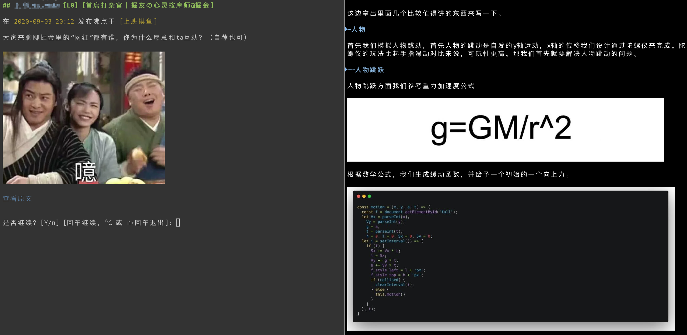

# semo-plugin-juejin

> 由于本插件只服务于中文技术社区，所以项目 Readme 用中文来写。

这是一个 [Semo](https://semo.js.org) 的插件，实现了一个命令行版的掘金客户端（非官方）。对于掘金的开放内容，主要是文章还有沸点，很多文章都写的很用心，而沸点则包罗万象，可以用来划水也可以学到东西。

本工具只是用来访问掘金的开放内容，没有登录掘金账号进一步互动的功能。

为了更好的体验，本项目只支持 Mac 系统的 iterm2 命令行终端，其他系统和其他命令行终端也支持，但是 `mdcat` 模式就不支持了，也就是看不了图片了。

## 安装和使用说明

所有的 `Semo` 插件都需要先全局安装 `Semo` 命令行调度器。

```
npm i -g @semo/cli semo-plugin-juejin
brew install mdcat # 下面的命令选项里有 mdcat 模式，需要安装这个工具。
```

安装好以后我们看看命令的帮助信息：

```
semo juejin

掘金命令行客户端[非官方]

Commands:
  semo juejin pin [topic]                   看掘金沸点
  semo juejin post [category] [tag] [sort]  看掘金文章

Options:
  --version   Show version number                                                                              [boolean]
  -h, --help  Show help                                                                                        [boolean]
```

可以看到一共有两个命令，分别看一下每个命令的帮助：

```
$ semo juejin pin help                                                                                                                                                    [0:53:19]
semo juejin pin [topic]

看掘金沸点

Options:
  --version      Show version number                                                                           [boolean]
  --size, -S     每次看几条沸点，默认一条                                     [choices: 1, 2, 4, 5, 10, 20] [default: 1]
  --less, -L     使用 less 模式
  --mdcat, -M    使用 mdcat 模式，需要先安装
  --default, -D  参数使用默认值
  -h, --help     Show help                                                                                     [boolean]
```

还有

```
$ semo juejin post help                                                                                                                                                   [0:54:20]
semo juejin post [category] [tag] [sort]

看掘金文章

Options:
  --version        Show version number                                                                         [boolean]
  --default, -D    参数使用默认值
  --mdcat, -M      使用 mdcat 模式，需要先安装
  --copy, -C       看文章的同时保存到剪贴板
  --copy-only, -O  不看文章，只把文章保存到剪贴板就返回
  --uuid
  -h, --help       Show help                                                                                   [boolean]
```

每个选项都很好理解，下面说一说常用的组合：

```bash
semo juejin pin -D # 用默认选项看沸点
semo juejin pin -DL # 使用 less 模式，我不想看图
semo juejin ping -D -S 2 # 一次看两条也是可以的。
semo juejin post -D # 用默认选项看文章
semo juejin post -DC # 一边看还一边进剪贴板，方便进一步加工和保存
semo juejin post -DO # 不看内容，只复制到剪贴板，然后拷贝到其他笔记工具里阅读
semo juejin post -DM # 使用 mdcat 模式，我要看图
```

## 截图

一边看沸点，一边学习 😀



## 注意

由于掘金改域名，从 v2 开始支持，建议升级到最新版本

## 协议

MIT
